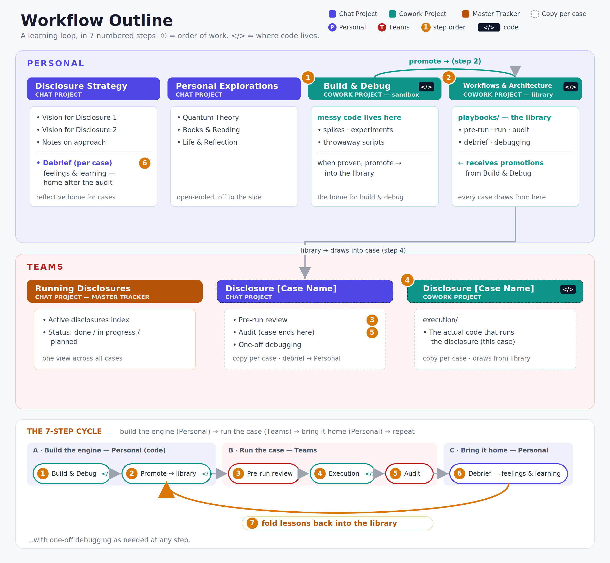

# Workflow Outline



A repository scaffold mirroring how Disclosure work is organized across
**Personal** and **Teams** spaces, using a mix of *Chat Projects* (thinking,
tracking, review) and *Cowork Projects* (code and execution).

This repo is the source of truth for **structure and reusable playbook
templates**. Individual chats live in the product; the files here capture the
durable artifacts — indexes, status, vision notes, and the reusable playbooks
that any disclosure run draws from.

## Top-level map

```
PERSONAL
├── Disclosure Strategy        (Chat Project)   → personal/disclosure-strategy/
│     └── debriefs/            post-case "feelings & learning" → personal/disclosure-strategy/debriefs/
├── Personal Explorations      (Chat Project)   → personal/personal-explorations/
├── Workflows & Architecture   (Cowork Project) → personal/workflows-and-architecture/
│     └── playbooks/           the reusable library (incl. debrief)
└── Build & Debug              (Cowork Project) → personal/build-and-debug/
      └── messy code sandbox → promoted into Workflows & Architecture

TEAMS
├── Running Disclosures        (Chat Project)   → teams/running-disclosures/        (master tracker)
├── Disclosure [Case Name]     (Chat Project)   → teams/disclosure-case-template/   (per-case review/audit/debug)
└── Disclosure [Case Name]     (Cowork Project) → teams/disclosure-case-template/execution/  (the actual run)
```

## Project types

| Type | Purpose | Lives where |
|------|---------|-------------|
| **Chat Project** | Thinking, vision, review, audit, tracking | `*/README.md` + topic notes |
| **Cowork Project** | Code, playbooks, and execution of a run | `workflows-and-architecture/`, `*/execution/` |

## How the pieces connect

- **Personal → Workflows & Architecture** holds the *reusable* playbooks
  (pre-run review, run, audit, debugging, debrief) — the clean library.
- **Personal → Build & Debug** is a separate Cowork project: the messy sandbox
  where disclosure code is written and debugged, then **promoted** into the
  Workflows & Architecture library once proven.
- **Teams → Running Disclosures** is the master tracker: one index, one status
  view across every active and planned case.
- **Teams → Disclosure [Case Name]** is a per-case workspace. Copy
  `teams/disclosure-case-template/` for each new case; its playbooks point back
  to the reusable library in Personal.

### The learning loop

This is a **cycle**, not a one-way pipeline:

```
library  ──draws into──►  case (pre-run → execution → audit, in Teams)
   ▲                                      │
   │                                      ▼
   └──── lessons ◄──── debrief (back in Personal: feelings & learning)
```

The **audit stays in Teams** (*did it work?*). The **debrief comes home to
Personal** (*what did I learn, how did it feel?*). Each debrief's lessons are
folded back into the library — that return edit is what makes the next case
start better.

## Where the code lives

Code sits in **three places**, split cleanly between Personal and Teams. The
separation is the point: Personal holds the *reusable engine*, Teams holds the
*per-case run*.

| # | Location | Space | What kind of code |
|---|----------|-------|-------------------|
| 1 | `personal/build-and-debug/` | **Personal** | Messy dev — spikes, experiments, throwaway scripts |
| 2 | `personal/workflows-and-architecture/playbooks/` | **Personal** | Clean, reusable library (proven code promoted up from 1) |
| 4 | `teams/disclosure-<case>/execution/` | **Teams** | The actual code that runs *this* case |

- **Personal code (1 & 2)** = build it once, reuse it everywhere. Write rough in
  Build & Debug, promote the proven parts into the Workflows & Architecture
  library.
- **Teams code (4)** = one per case. It *draws from* the Personal library; it
  never holds the only copy of anything reusable.

## Order of operations — the 7 steps

The numbers above and below match: this is the order you work in, every cycle.

**Build the reusable engine (Personal):**
1. **Build & Debug** — write and debug code in `personal/build-and-debug/`. *(code)*
2. **Promote → library** — move the proven, generalized parts into
   `personal/workflows-and-architecture/playbooks/`. *(code)*

**Run a case (Teams):**
3. **Pre-run review** — go / no-go in `teams/disclosure-<case>/pre-run-review.md`.
   *(First copy `teams/disclosure-case-template/` to `teams/disclosure-<case>/`
   and register it in `teams/running-disclosures/active-disclosures-index.md`.)*
4. **Execution** — run the case's code in `teams/disclosure-<case>/execution/`. *(code)*
5. **Audit** — *did it work?* in `teams/disclosure-<case>/audit.md`. The case ends here.

**Bring it home (Personal):**
6. **Debrief** — *what did I learn, how did it feel?* Add
   `personal/disclosure-strategy/debriefs/debrief-<case>.md`.
7. **Fold lessons back into the library** — edit the playbooks in
   `personal/workflows-and-architecture/playbooks/`. This returns you to **step 2**
   and makes the next case start better.

> …with **one-off debugging** (`teams/disclosure-<case>/one-off-debugging.md`)
> as needed at any step.

See each directory's `README.md` for detail.
